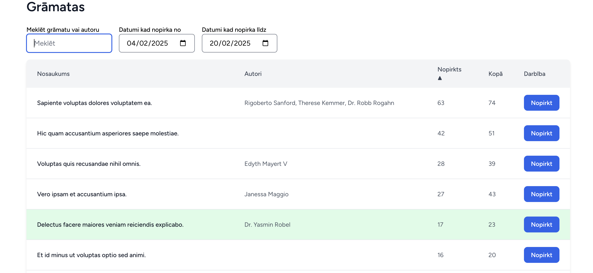

```sh
git clone https://github.com/Imantz/bookzilla.git && cd bookzilla
```

```sh
npm install
```

```sh
docker compose -f compose.dev.yaml up -d
```

```sh
npm run dev
```

```sh
docker exec -it bookzilla-workspace-1 bash -c "php artisan migrate --seed"
```

```sh
docker exec -it bookzilla-workspace-1 bash -c "php artisan key:generate"
```

Skatīt:
http://localhost/books

API endoints – pieprasot, var iegūt šī mēneša(februāra) top 10 grāmatas:
http://localhost/api/v1/books?sort_by=purchases&sort_order=desc&date_from=2025-02-01&date_to=2025-02-28&limit=10


